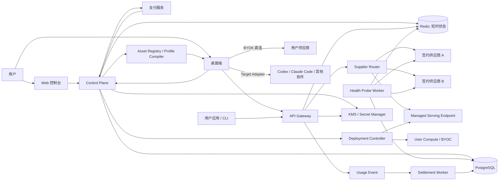

# 技术架构

状态：建议基线；支付、地区和上游方案确定后再冻结具体云厂商。

两大产品面、三层供给和供应商结算的完整决策见 [08-two-surface-aggregator-architecture.md](./08-two-surface-aggregator-architecture.md)；开放模型和工作环境的增量设计见 [09-open-models-portable-workspace.md](./09-open-models-portable-workspace.md)。

## 1. 架构原则

1. 桌面端、控制面、网关、账本分开部署和授权。
2. 请求日志不是账本，余额字段不是事实源，缓存不是权限源。
3. 模型、线路和价格分别建模，禁止用一个 `models` JSON 同时承担三者。
4. 在线请求路径不依赖支付服务；支付路径不直接修改余额。
5. 默认无正文日志，默认无第三方 BYOK 上云，默认本地代理只绑定 loopback。
6. 每次请求、计量、结算和账本流水可用 ID 串联。
7. 先做模块化单体控制面和独立网关，不为“微服务”提前拆分一致性边界。
8. 广场收录、工作台连接和统一余额销售是三个不同状态；只有签约供给进入云网关与平台结算。
9. 开放模型的模型工件、服务修订、算力端点和价格必须分离；名称相同不代表部署相同。
10. 工作环境以开放、可导出的规范对象为事实源，目标软件配置是 Adapter 生成的 projection。
11. Secret 不进入 WorkspaceProfile 或迁移包；会话迁移不得伪装成恢复厂商私有运行时。

## 2. 系统边界



### Control Plane

负责账号、模型目录、线路配置、平台 Key、设备、导入票据、订单、价格版本、账本查询、管理端和审计。它不转发大模型流量。

### API Gateway

负责认证、授权、限额、协议归一化、路由、超时/取消、流式转发、计量、回退和请求级元数据。它不处理充值回调，也不直接改用户余额。

### Settlement Worker

负责把最终计量事件和价格版本转换为账本分录，释放预留、处理迟到事件、对账和异常队列。

### Health Probe Worker

负责从明确地区执行版本化合成探测，记录协议、连接、TTFT、总时延、计量和能力一致性信号；它不保存用户提示词，也不把启发式结果当作供应授权或法律审计。

### Desktop

负责本机工具发现、Provider Profile、系统安全存储、配置预览/合并/备份、本地代理、Target Adapter、Profile 部署、迁移报告和连接测试。默认不托管云端资金或上游渠道。

### Deployment Controller

负责开放模型部署期望状态、权重与镜像校验、共享/专属/BYOC 端点生命周期、扩缩容和容量状态。它不在同步请求路径中创建或销毁实例，也不自行定义用户账单。

### Asset Registry / Profile Compiler

负责 WorkspaceProfile、MCP、Skills、Prompts、记忆、知识库源和版本；Compiler 根据目标软件及版本生成 `MigrationPlan`。实际本地发现、Secret 绑定和写入由 Desktop 完成。

## 3. 推荐技术栈

| 层 | 建议 | 原因 |
| --- | --- | --- |
| Web | React + TypeScript；公共模型/文档页面使用 SSR/SSG | 延续现有原型，同时保证可索引和快速首屏 |
| Desktop | Tauri 2 + React/TypeScript + Rust | 与 CC Switch 技术路径一致，便于复用本地适配经验 |
| Control Plane | TypeScript + Fastify/Nest 类框架，模块化单体 | 团队开发速度、Schema/SDK 共享、易接支付和后台 |
| Gateway | Rust + Axum/Hyper 类异步栈 | 流式转发、连接管理、内存安全，与桌面 Rust 能力复用 |
| Primary DB | PostgreSQL | 事务、账本、审计、关系约束和成熟迁移 |
| Ephemeral | Redis | 限流桶、短时 ImportGrant、幂等锁和断路器共享状态 |
| Queue | PostgreSQL Outbox 起步；规模后迁移消息系统 | MVP 避免双写和额外基础设施 |
| Observability | OpenTelemetry + Metrics/Logs/Traces | 请求链路、上游时延、结算与错误统一关联 |
| Secret | 云 KMS + Secret Manager；桌面 Keychain/Credential Manager | 不把主密钥或上游 Key 放数据库明文 |
| Open model serving | 首期采用成熟 vLLM/SGLang/llama.cpp 托管面；TGI 仅作为存量兼容；控制面只做编排抽象 | 降低自研推理引擎风险，同时保留能力合同和版本固定 |
| Artifact/Knowledge storage | 兼容 S3 的对象存储 + PostgreSQL 元数据 | 原始文档、Skill 包、模型 manifest 与索引 projection 分离 |

LiteLLM 可以在验证阶段作为协议适配候选，但如果采用，必须固定版本、运行合同测试、建立许可证 BOM，并且不能成为账本或价格事实源。

## 4. 领域模型

### Catalog

```text
Model
  id, slug, provider_family, display_name, modality, lifecycle_status

ProtocolCapability
  model_id, protocol, streaming, tools, json_schema, max_context, limits

UpstreamChannel
  id, supplier, credential_ref, regions, health, authorization_evidence

SupplierContract
  id, supplier_id, supply_mode, allowed_regions, resale_scope,
  settlement_mode, invoicing_terms, data_terms, valid_from, valid_to

RouteOffer
  id, model_id, upstream_channel_id, supplier_contract_id,
  supply_mode, tier, region, policy, status

RouteProbeDefinition
  id, version, protocol, scenario, region, timeout, expected_capabilities

RouteHealthSample
  id, route_offer_id, probe_definition_id, observed_at,
  success, ttft_ms, duration_ms, error_class, usage_delta, integrity_signal

PriceBook
  id, currency, status

PriceVersion
  id, route_offer_id, valid_from, valid_to,
  input_unit_price, output_unit_price, cache_read_price,
  image_price, rounding_rule, source, approved_by
```

`Model` 是用户请求的能力，`RouteOffer` 是如何供应，`PriceVersion` 是某个时间区间如何计费。三者生命周期不同，必须分离。

`RouteHealthSample` 是特定探测定义、地区和时间下的观测，不等于 SLA。对外聚合必须携带窗口、样本量和最后更新时间；无新鲜样本时状态为 `unknown/stale`，不能沿用旧的“正常”。

### Open model serving

```text
ModelArtifact
  id, repo, revision, weights_digest, license_id, license_evidence,
  tokenizer_revision, chat_template_digest, provenance, status

DeploymentTemplate
  id, engine, engine_version, hardware_class, region,
  dtype, quantization, default_args, tenancy, scale_policy

ServingRevision
  id, model_artifact_id, deployment_template_id,
  immutable_manifest_digest, capability_matrix, status

ComputePool
  id, owner_type, provider, region, hardware, tenancy, status

ServingEndpoint
  id, serving_revision_id, compute_pool_id, endpoint_ref,
  min_replicas, max_replicas, lifecycle_state, health

CapacityReservation
  id, user_id, serving_endpoint_id, valid_from, valid_to,
  reserved_capacity, spend_limit, status

DeploymentCostRate
  id, serving_revision_id, valid_from, valid_to,
  gpu_rate, storage_rate, egress_rate, service_fee, currency
```

开放模型的可复现服务身份至少固定：

```text
repo + revision + weights_digest + tokenizer + chat_template
+ dtype/quantization + engine/version + serving_args
```

`RouteOffer.target` 可以指向 `UpstreamChannel` 或 `ServingEndpoint`。共享端点可按 Token 发布 `PriceVersion`；专属/BYOC 成本使用 `DeploymentCostRate`，不能强行折算为看似精确的 Token 单价。

### Portable workspace

```text
WorkspaceProfile
  id, owner_id, name, version, project_scope, routing_policy_ref,
  asset_refs, target_policies, created_from, digest

McpServer
  id, version, protocol_revision, transport, endpoint_or_command, secret_refs,
  requested_scopes, tool_allowlist, provenance, signature

SkillBundle
  id, version, artifact_ref, digest, permissions,
  target_compatibility, scan_status, provenance, signature

PromptTemplate
  id, version, normalized_segments, variables,
  required_tools, target_variants, eval_refs

MemoryItem
  id, scope, statement, source_refs, confidence,
  sensitivity, review_status, expires_at, supersedes_id

KnowledgeBase
  id, canonical_document_refs, acl, data_classification,
  sync_policy, chunk_policy, target_index_refs

PortableSession
  id, source_app, raw_export_ref, normalized_transcript_ref,
  checkpoint_ref, artifacts, open_tasks, status

SecretBinding
  id, owner_id, local_or_kms_ref, allowed_asset_id, scopes

MigrationPlan / MigrationReport
  id, profile_version, target, target_version, backup_ref,
  item_results, permission_diff, verification, rollback_status
```

每个迁移项只有 `exact`、`adapted`、`rebuilt`、`unsupported` 四类结果。WorkspaceProfile 导出只包含可移植资产、manifest 和 Secret 需求，不包含 Secret 明文。

### Identity and access

```text
User
Project                 # MVP 可先每用户一个默认项目
ApiCredential
  id, project_id, prefix, secret_digest, scopes, status,
  spend_limit, expires_at, last_used_at
DesktopDevice
  id, user_id, public_key, platform, client_version, last_seen_at
ImportGrant
  id, user_id, device_id, tool, model_id, route_preference,
  one_time_digest, expires_at, consumed_at
```

### Request and usage

```text
ApiRequest
  id, credential_id, requested_model, actual_model, route_offer_id,
  protocol, status, started_at, completed_at, price_version_id

UsageEvent
  id, request_id, source, input_units, output_units, cache_units,
  upstream_cost, final, observed_at, payload_version

Settlement
  id, request_id, usage_event_id, price_version_id,
  customer_amount, upstream_amount, status
```

UsageEvent 需要幂等键，迟到的上游最终用量不得重复结算。原始上游字段可保存在受限 JSON 中，但标准化字段必须显式列化。

### Ledger and payment

```text
LedgerAccount
LedgerTransaction
LedgerPosting
  transaction_id, account_id, direction, amount_minor, currency

PaymentOrder
  id, user_id, provider, amount_minor, currency, status,
  provider_reference, idempotency_key

CreditGrant
  id, source, amount_minor, expires_at, restrictions
```

每个 LedgerTransaction 的借贷总额必须平衡。余额从 Posting 聚合或受控快照派生，不能通过 `UPDATE users SET balance = ...` 作为唯一事实。

建议账户类型：

- 用户可用额度负债
- 调用收入
- 支付清算
- 上游成本应付
- 促销额度负债
- 退款应付
- 手工调账

## 5. 网关请求路径

```text
1. TLS / request-id
2. 解析 Key 前缀并校验 keyed digest
3. 检查账号、Key、模型、协议、地区、金额与速率权限
4. 读取当前 Catalog snapshot 和 PriceVersion
5. 预留最坏情况或动态可控额度
6. 构造 RouteCandidate，排除不健康、不允许或健康证据过期的线路
7. 协议适配并发送上游
8. 流式转发；处理客户端取消和上游中断
9. 标准化最终用量，写 UsageEvent + Outbox
10. Worker 结算并释放预留
11. 返回请求 ID、实际模型、线路等级和回退信息
```

### 回退规则

- 认证错误、模型不存在、无权限等确定性 4xx 默认不回退。
- 超时、连接错误、明确限流和可恢复 5xx 可按策略回退。
- 工具调用/流式响应已经向客户端输出后，不能无痕切换并重放；应终止并返回可识别错误。
- 同一请求的多次上游尝试只产生一个用户结算，但要记录各尝试的上游成本。
- 跨模型回退必须在请求或项目策略中显式开启。

### 错误格式

内部统一错误：

```json
{
  "error": {
    "code": "insufficient_balance",
    "message": "余额不足，未向上游发送请求。",
    "request_id": "req_...",
    "retryable": false,
    "action_url": "https://moyusi.example/billing"
  }
}
```

协议适配层再映射到 OpenAI/Anthropic 兼容格式，同时保留 `request_id`。

## 6. API 面

### 公共控制面

```text
GET    /api/catalog/models
GET    /api/catalog/models/:slug
GET    /api/catalog/version

GET    /api/keys
POST   /api/keys
POST   /api/keys/:id/revoke

GET    /api/usage/summary
GET    /api/usage/requests
GET    /api/ledger/transactions

POST   /api/billing/orders
GET    /api/billing/orders/:id

GET    /api/devices
POST   /api/desktop/import-grants
POST   /api/desktop/import-grants/:code/exchange

GET    /api/deployments
POST   /api/endpoints/connections:test
POST   /api/deployments
POST   /api/deployments/:id/stop

GET    /api/workspace-profiles
POST   /api/workspace-profiles
POST   /api/workspace-profiles/:id/versions
POST   /api/workspace-profiles/:id/migration-plans
POST   /api/migration-plans/:id/apply-grant
GET    /api/migration-reports/:id
```

### 模型兼容面

```text
GET  /v1/models
POST /v1/responses
POST /v1/chat/completions
POST /v1/messages
```

首发不承诺所有 OpenAI/Anthropic 参数。支持矩阵必须版本化，未支持参数返回明确错误，不能静默丢弃。

### 响应元数据

建议使用安全、稳定的字段：

```text
x-moyusi-request-id
x-moyusi-actual-model
x-moyusi-route-tier
x-moyusi-fallback-count
```

具体上游账号、凭证、内部主机和采购关系不得暴露；用户需要的是可解释线路标识，不是敏感拓扑。

## 7. 桌面端安全接入协议

### 禁止方案

- `moyusi://import?api_key=sk-...`
- 把 Key 放剪贴板后自动读取。
- Web 直接修改本地配置且没有变更预览。
- 在配置文件中明文保存平台 Key，除非目标工具本身只支持该方式且用户已知情。

### 推荐流程

1. Web 创建 `ImportGrant`，只得到一次性 opaque code。
2. Web 打开 `moyusi://import?grant=<code>`。
3. 桌面端用设备私钥签名 nonce，并向 Control Plane 交换配置载荷。
4. 服务端验证用户、设备、目标工具、过期时间和未消费状态，然后一次性消费。
5. 桌面端把平台 Key 放系统安全存储；配置文件写引用、环境变量桥或工具要求的最小明文。
6. 桌面端展示字段级 diff，用户确认后原子写入。
7. 连接测试成功后回报不含凭证的设备状态。

`ImportGrant` 即使出现在浏览器历史中，也因短时、单次和设备绑定而不能直接调用模型 API。

### WorkspaceProfile 部署流程

1. Control Plane 根据 Profile 版本、Target Adapter 和目标软件版本生成不含 Secret 的 `MigrationPlan`。
2. Desktop 本地发现现有配置，并把仅包含结构/版本的 capability result 合并进计划。
3. 用户在本机绑定 Secret，确认 MCP/Skill 权限和字段级 diff。
4. Desktop 创建明确路径的备份，使用临时文件 + fsync + rename 原子写入。
5. Adapter 运行语法、模型、MCP、Skill 和知识来源验证，生成逐项 `MigrationReport`。
6. 阻断验证失败时恢复备份；成功后只同步脱敏状态和资产版本。

Target Adapter 必须按软件版本维护配置 fixture、黄金 diff、冲突合并和回滚测试。官方登录、用户手工配置和未知字段默认保留；无法安全合并时停止并要求用户决定。

## 8. CC Switch 复用策略

### 方案比较

| 方案 | 速度 | 上游更新 | 品牌独立 | 风险 |
| --- | --- | --- | --- | --- |
| 直接 fork 全部应用 | 快 | 合并成本高 | 高 | 大量非 MVP 功能与长期漂移 |
| 抽取配置适配与代理核心 | 中 | 边界清楚 | 高 | 初期重构工作较大 |
| 只做 Moyusi Provider/深链适配 | 最快 | 依赖用户安装 CC Switch | 中 | 体验仍跨两个产品 |

### 建议

Phase 0 先实现 CC Switch 可消费的安全导入或 Provider 模板来验证闭环；Phase 1 再维护 Moyusi 品牌桌面端。若 fork：

- 保留 MIT 版权和许可声明。
- 维护 `NOTICE` 和第三方许可证清单。
- 不默认复用 CC Switch 名称、Logo、域名和推荐语。
- 把上游代码放清晰边界，Moyusi 云连接做成独立模块。
- 每个上游版本运行配置迁移、原子写入、异常恢复和工具兼容回归。
- 以小 patch stack 跟随上游，不在核心适配器内混入支付或云账本逻辑。

## 9. 安全与隐私

### 平台 Key

- 格式包含可索引前缀和高熵 secret。
- 数据库保存 `prefix + keyed digest`，不保存可逆明文。
- 创建时只返回一次；日志、APM、分析和客服工具一律脱敏。
- 验证使用常量时间比较；pepper 存 KMS/Secret Manager。

### 上游凭证

- 只允许授权供应来源。
- 云端凭证采用 envelope encryption，按环境和用途隔离。
- Gateway 通过短时解密能力获取，操作有审计。
- 桌面 BYOK 使用 macOS Keychain、Windows Credential Manager 或 Linux Secret Service。

### 数据留存默认值建议

| 数据 | 默认 |
| --- | --- |
| 请求/响应正文 | 不持久化 |
| 请求元数据与计量 | 按账务、支持和法定义务确定，公开说明 |
| 短期诊断 | 24–72 小时，字段白名单 |
| 审计日志 | 至少覆盖账务和安全审查周期 |
| ImportGrant | 60 秒或消费后立即无效 |
| 原始支付回调 | 加密、限制访问、按财务规则保留 |

### 威胁模型重点

- Key 泄漏与撞库。
- 支付重放、伪造 webhook 和拒付套利。
- 余额并发超扣与流式断线逃费。
- 上游凭证外泄和供应商越权。
- 模型 ID/协议转换导致的错误路由或错误计费。
- 本地深链劫持、恶意配置注入和非 loopback 代理暴露。
- Prompt/response 被日志、异常平台或分析 SDK 收集。
- 管理员人工调账、定价发布和渠道切换的内部滥用。
- 恶意 MCP Server 执行命令、扩大数据访问或诱导授权。
- SkillBundle 携带恶意脚本、提示注入或供应链更新投毒。
- WorkspaceProfile 导出夹带 Secret，或迁移扩大原有工具权限。
- 记忆/知识库越权同步、撤权后索引残留或私密上下文被路由到不合规端点。
- 开放模型权重、容器、chat template 或量化版本被替换而仍沿用原模型身份。

## 10. 一致性与幂等

- 支付：以 `provider_event_id` 唯一约束，Webhook 重试不重复入账。
- 订单：客户端 `idempotency_key` + 用户 ID 唯一。
- 请求：平台生成 `request_id`；用户 Idempotency-Key 只对明确支持的非流式操作生效。
- UsageEvent：`request_id + attempt + finality + source_event_id` 唯一。
- Settlement：一个请求一个最终用户结算版本；修正通过补偿分录，不改旧分录。
- Outbox：业务事务内写事件，Worker 至少一次消费并靠唯一键去重。

## 11. 可观测与运营

### 指标

- Gateway：请求量、成功率、p50/p95/p99、TTFT、流式中断、各线路错误和回退。
- Probe：按地区/版本的样本量、成功率、p50/p95、用量差异、能力异常和数据新鲜度。
- Billing：预留、结算延迟、重复事件、负余额、账本不平衡、对账差异。
- Desktop：安装版本、接入成功率、配置冲突、回滚、连接错误类别。
- Catalog：价格发布、失效报价、无健康线路模型。
- Serving：部署启动/冷启动、权重拉取、GPU 利用率、排队、吞吐、模型身份与成本偏差。
- Profile：各 Adapter 部署成功率、exact/adapted/rebuilt/unsupported 分布、权限变化和回滚结果。

### 日志

- 全部结构化，包含 request_id/trace_id。
- Key、Cookie、Authorization、支付凭证、正文进入日志前强制删除。
- 错误对象分安全字段和内部字段，不能直接序列化第三方响应头。

## 12. 测试策略

1. **合同测试**：每个协议的流式、工具调用、错误、取消、Token 计量。
2. **账本性质测试**：任一事务借贷平衡；任意 webhook 重放结果一致。
3. **路由故障注入**：超时、429、5xx、部分流、错误模型、断路器半开。
4. **Desktop fixture**：为每个工具保留多版本配置样本和黄金 diff。
5. **Adapter 合同测试**：Profile 的 exact/adapted/rebuilt/unsupported 分类、权限 diff、备份和回滚。
6. **开放模型合同测试**：固定 ServingRevision 的协议、流式、工具、计量、取消、冷启动与模型身份。
7. **安全测试**：Key 扫描、深链重放、恶意 MCP/Skill fixture、Secret 导出、非 loopback 监听、日志脱敏、权限绕过。
8. **端到端**：注册 → 充值模拟 → 建 Key → 导入 Profile → 首次请求 → 账本核对。
9. **对账回放**：使用冻结价格和上游账单样本重建结算。

## 13. 仓库建议

```text
moyusi/
  apps/
    web/
    desktop/
    admin/
  services/
    control-plane/
    gateway/
    worker/
  packages/
    api-contracts/
    catalog-types/
    ui/
    config-fixtures/
  infra/
    migrations/
    deploy/
  docs/
  third_party/
    notices/
```

不要把 Control Plane、Gateway 和 Desktop 强行打成一个可执行程序；可以同仓协作，但发布、密钥和故障域必须分离。
