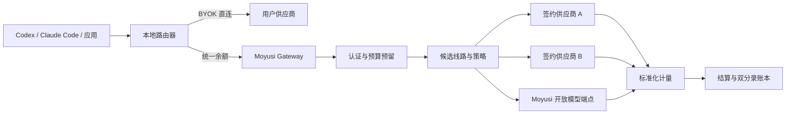

# 两大产品面与多源模型聚合架构

状态：产品与商业架构建议稿  
日期：2026-08-28

## 1. 核心结论

Moyusi 应从“模型商城 + 多个管理页”收敛为两个产品面：

1. **模型广场**：按模型聚合全网可用供给，覆盖闭源 API 与开放模型算力，帮助用户选模型、比较线路/部署并加入工作台。
2. **工作台**：提供接近 CC Switch 完整度的本地切换与路由，并整合平台 Key、BYOK、模型部署、可迁移工作环境、用量、充值、账本、设备和账号安全。

“我的”不再成为一级页面；账户、设备、安全、发票和偏好都属于工作台。

商业上不建议把 Moyusi 定义为简单的“中转站的中转站”。更准确的定义是：

> **模型访问与 AI 工作环境的可迁移控制层**：把闭源 API 与开放模型部署标准化，把签约供给纳入统一余额，把长尾供给和用户算力接入同一工作台，并让用户跨模型与软件携带自己的工作环境。

聚合范围和可销售范围必须分开。模型广场可以广泛收录，但只有具备商业授权、地区许可、可靠计量和可结算关系的线路才能标记为“统一余额可用”。

## 2. 为什么不能给所有中转站都简单储值

只在每个平台开一个零售账号并预存余额，虽然上线快，但不适合作为长期供给方式：

- 零售条款未必允许再次销售、共享账号或把 Key 提供给第三方用户。
- 资金分散在多个不可退款或可能失效的余额中，形成库存、汇率和供应商跑路风险。
- 价格、模型映射、Token 口径和退款规则不同，无法仅凭前端余额做到准确结算。
- 一个上游账号或 Key 被封禁会同时影响大量用户，且难以提供用户级限额和审计。
- 多套中转叠加延迟、日志和内容处理方，故障归因及数据责任更复杂。

OpenRouter 面向供应商的公开接入说明同时支持 **自动充值或发票结算**，而不是要求平台永久预存大额余额；其供应商还需提供模型、价格、容量和停用状态，并接受健康探测与按月计量结算。这说明规模化聚合的核心是供应合同和结算接口，不是多买几个零售 Key。[OpenRouter Provider Integration](https://openrouter.ai/docs/guides/community/for-providers)

Cloudflare Unified Billing 也把平台托管凭证、BYOK 和请求自带凭证做了明确优先级，并通过统一积分结算而非让用户管理每个供应商 Key。[Cloudflare Unified Billing](https://developers.cloudflare.com/ai-gateway/features/unified-billing/)

## 3. 推荐的三层供给模式

### A. Moyusi 统一余额供给

用户只持有 Moyusi 平台 Key，请求经过 Moyusi Gateway，由平台选择签约线路并从 Moyusi 余额扣费。

适用条件：

- 供应商书面允许代理、转售、嵌入应用和故障转移。
- 有企业主账号、子账号、专用凭证或明确的请求归属能力。
- 能通过 API 或账单提供模型、价格、用量和余额事实。
- 支持自动充值、周期发票或授信结算。
- 约定地区、数据留存、模型真实性、价格变更、争议和退出处理。

这是唯一可以承诺“统一充值、统一账单”的供给类型。

### B. 用户自带 Key（BYOK）

用户已经在模型厂商或中转站购买额度，Moyusi 只负责切换、协议适配、健康检查和路由。第三方 Key 默认保存在桌面系统安全存储，请求可由本地代理直接发往供应商。

特点：

- 不占用 Moyusi 上游资金，也不承担推理差价。
- 适合快速覆盖长尾供应商和用户已有资产。
- 上游费用由用户与供应商直接结算，不能计入 Moyusi 统一余额。
- Moyusi 可收取桌面 Pro、团队治理或高级路由服务费，但必须把费用与推理费分开。

### C. 供应商直连 / 导购

模型广场展示供应商报价和适配状态，用户跳转供应商开户注册；Moyusi 通过模板、OAuth、子账号或安全导入连接工作台。

特点：

- 可扩大“全网收录”覆盖，不制造未经授权的转售关系。
- 可采用推荐佣金或渠道返点，但不得把未验证营销文案当成线路事实。
- 供应商不支持可靠 API、计量或授权时，只允许停留在这一层。

### 未来：供应商市场结算

成熟后允许供应商直接接入 Moyusi Provider API，报告模型、能力、价格、容量和停用时间；Moyusi 负责探测、分流、用户扣费与月度对账，供应商按实际用量开票或收款。这是比“平台到处储值”更好的规模化形态。

## 4. 统一余额的推荐采购策略

| 方式 | 启动速度 | 资金占用 | 合规与稳定性 | 建议 |
| --- | --- | --- | --- | --- |
| 多个平台零售预存 | 快 | 高且分散 | 条款、封号、退款和模型来源风险高 | 仅限小额技术验证，不对外销售 |
| 签约主账号 + 自动充值 | 中 | 可控 | 需要书面授权和余额/用量 API | 适合首批供应商 |
| 周结/月结授信 | 中慢 | 低 | 对合同、风控和对账要求高 | 规模后优先 |
| 供应商市场按月结算 | 慢 | 最低 | 需要准入、发票、争议与质量体系 | 长期目标 |
| BYOK / 用户直付 | 快 | 无 | 无法做到统一推理账单 | 长尾覆盖默认方式 |

推荐组合：

- 首发只签 **2–3 个** 有授权和可对账能力的共享供给方，覆盖 10–20 个高频模型。
- 对共享供给使用“低余额阈值自动补充 + 单供应商风险上限”，不要一次预存数月用量。
- 有条件时切换为周结/月结和信用额度；用户余额与供应商应付款分账记录。
- 其余中转站先作为 BYOK 连接器或直连入口，不进入统一余额。
- 任何只有个人零售 Key、无法提供授权或发票的渠道，不进入生产共享池。

建议资金参数按消费预测动态计算：

```text
目标上游余额 = p95 日成本 × 覆盖天数 + 自动充值到账缓冲
单供应商风险敞口 = 预存余额 + 未结算用量 + 争议金额
```

波动较大的中转站把覆盖天数控制在较短区间；超过风险上限后自动降权或停止新流量，而不是继续充值。

## 5. 两个产品面的信息架构

### 5.1 模型广场

模型广场按“模型能力”组织，不按中转站或 GPU 厂商组织。一个模型下可以有多个 `RouteOffer`；开放模型还可以有共享端点、专属部署和用户自有端点。

```text
模型广场
├── 发现：编程、推理、长文本、视觉、低延迟、低成本
├── 搜索与筛选：厂商、闭源/开放权重、协议、上下文、价格、地区、数据政策
├── 模型详情
│   ├── 能力与适用任务
│   ├── 稳定 API model id
│   ├── 支持参数和工具调用
│   ├── 多线路报价
│   └── 开放模型的许可、revision、量化、引擎和部署方式
└── 操作：加入工作台 / 立即接入
```

每条线路至少展示：

- 来源名称与供给类型：统一余额、BYOK 或供应商直连。
- 用户价格、计费单位、币种、价格更新时间和是否含平台服务费。
- 协议与参数兼容度、上下文、流式和工具调用能力。
- 成功率、TTFT、总时延、吞吐、样本窗口、地区和最后探测时间。
- 数据留存、训练使用、内容处理地区和供应商政策入口。
- 实际模型版本、是否允许同模型回退，以及可能发生的协议转换。
- 对开放模型额外展示权重来源/revision/digest、许可证、量化、推理引擎、硬件、租户方式、热/冷状态与按 Token/GPU 小时等费用。

默认排序先排除不可用、不兼容和政策不满足的线路，再综合稳定性、工具调用成功率、价格、延迟和吞吐。OpenRouter 的公开路由设计也先排除近期故障线路，再在稳定候选中按价格加权，并允许用户按价格、吞吐或延迟指定偏好。[OpenRouter Provider Routing](https://openrouter.ai/docs/guides/routing/provider-selection)

### 5.2 工作台

工作台是一个产品面，不等于把所有功能塞在同一屏。可使用左侧子导航或页内分段，但不再增加一级站点导航。

```text
工作台
├── 总览：当前工具、活动路由、余额、今日费用、告警
├── 路由
│   ├── Codex / Claude Code / 后续工具
│   ├── Provider Profile 与优先级
│   ├── 模型映射、健康、回退、熔断
│   └── 快速切换、托盘、本地代理
├── API 与来源
│   ├── Moyusi 平台 Key
│   ├── 本地 BYOK
│   ├── 已连接供应商账号
│   └── 权限、限额、轮换与测试
├── 模型与部署
│   ├── 共享开放模型
│   ├── 专属端点与容量
│   ├── 用户自有算力 / 自托管端点
│   └── revision、引擎、量化、硬件和运行状态
├── 工作环境
│   ├── WorkspaceProfile
│   ├── MCP、Skills、Prompts
│   ├── 经审核记忆与知识库
│   └── 目标软件、兼容性、迁移报告与回滚
├── 用量与计费
│   ├── 统一余额、充值、自动充值
│   ├── 请求、Token、费用和实际线路
│   ├── 账本、订单、退款与发票
│   └── BYOK 外部费用提示
└── 账户
    ├── 登录与安全、设备、会话
    ├── 通知与偏好
    └── 数据与隐私
```

工作台首页只展示当前路由和需要处理的问题；Key、账本和账号通过子导航进入，避免重新形成“大而全控制台”。

## 6. CC Switch 能力的取舍

CC Switch 当前公开能力包括多工具 Provider 管理、一键切换、本地代理、协议转换、故障转移、熔断、健康监测、用量成本、原子写入、备份和托盘切换。[CC Switch GitHub](https://github.com/farion1231/cc-switch)

Moyusi 要追求的是“路由切换同样完善”，不是复制其所有外围功能。

### P0：必须达到

- Codex 与 Claude Code Provider Profile。
- 一键启用、排序、导入/导出和恢复官方登录。
- 本地代理热切换、同模型回退、超时、熔断与主动健康检查。
- OpenAI / Anthropic 协议及工具调用映射。
- 配置 diff、原子写入、自动备份和恢复。
- 系统托盘快速切换、连接测试和明确错误分类。
- 本地用量与 Moyusi 云端结算用量能区分并合并展示。
- 至少一个共享开放模型和一个用户自有 OpenAI-compatible 端点的接入。
- Codex/Claude Code 私有 WorkspaceProfile，以及 MCP、Skills、Prompts 的版本、diff、部署和回滚。

### P1：扩展覆盖

- Gemini CLI、OpenCode 等更多工具。
- 跨设备同步非敏感配置。
- 项目级路由、预算、地区和数据策略。
- 托管开放模型部署，以及经用户审核的记忆和源文档知识库。

### 暂不继承

- 公共 MCP/Skills 市场、复杂在线工作区编辑和内容社区。
- 厂商会话进程、隐藏推理、私有缓存和工具内部状态的“无损恢复”。

## 7. 请求与计费路径



关键边界：

- BYOK 直连时，Moyusi 不应声称统一扣除推理费；只能展示本地估算或供应商回传账单。
- 统一余额时，请求必须经过 Moyusi Gateway，或供应商必须提供带请求 ID 的可信计量回调。
- 用户只看到 Moyusi 平台 Key；平台共享供给凭证进入 KMS/Secret Manager，不写入桌面配置。
- 每次请求绑定实际 `RouteOffer`、供应合同、价格版本、上游成本和用户结算。
- 同一模型可自动回退；跨模型家族不静默替换。

## 8. 聚合领域模型

```text
CanonicalModel       # 标准模型与明确版本
Supplier             # 模型厂商、推理平台或中转站
SupplierContract     # 授权、地区、结算、数据和退出条款
SupplierAccount      # 主账号/子账号，不等于可公开销售
CredentialPool       # 按环境、地区和用途隔离的供应凭证
RouteOffer           # 某供应商对某模型的可售线路
ModelArtifact        # 开放模型 repo/revision/digest/license
ServingRevision      # 权重 + 模板 + 量化 + 引擎 + 参数的不可变组合
ServingEndpoint      # 共享、专属或 BYOC 算力端点
DeploymentCostRate   # GPU/存储/流量/服务费版本
ProtocolCapability   # 参数、流式、工具调用与转换范围
PriceVersion         # 用户价、上游成本、服务费和生效区间
RouteHealthWindow    # 窗口、样本、地区、成功率和性能
RoutingPolicy        # 价格/稳定/延迟偏好与回退边界
UsageEvent           # 平台与供应商原始计量
Settlement           # 用户扣费、上游应付、差异和状态
LedgerTransaction    # 不可变资金事实
WorkspaceProfile     # 路由与 AI 工作资产的可移植版本
TargetAdapter        # 为特定软件/版本生成、验证和回滚配置
MigrationReport      # exact/adapted/rebuilt/unsupported 逐项结果
```

`Supplier`、`SupplierAccount` 和 `RouteOffer` 必须分开。同一个中转站可以有多个结算账号、地区和凭证池；同一模型也可以同时有统一余额、BYOK 和直连报价。

`ModelArtifact`、`ServingRevision` 和 `ServingEndpoint` 也必须分开；同一开放权重模型在不同 revision、量化、chat template 或引擎参数下不能作为完全相同的服务销售。工作环境的完整对象与迁移边界见 [09-open-models-portable-workspace.md](./09-open-models-portable-workspace.md)。

## 9. 供应商接入最低合同与技术条件

### 商务条件

- 明确允许代理/转售、集成到客户应用和服务终端用户的范围。
- 明确可服务国家/地区、用户类型和禁止场景。
- 模型来源与版本承诺，禁止未经同意的模型降级或替换。
- 价格、生效提前期、最低消费、税费、发票、退款和争议窗口。
- SLA、限流、紧急下线、数据事件和合同终止后的用户处理。
- 数据留存、训练使用、子处理方、跨境路径和删除机制。

### 技术条件

- `/models` 或等价模型目录，以及版本、能力、价格和下线时间。
- 流式/非流式最终用量，稳定请求 ID 和幂等语义。
- 余额/授信、用量、订单或月账单 API；人工截图不能成为结算事实源。
- 用户错误、限流、供应商故障、模型不存在和余额不足的可区分错误码。
- 主动探测、容量声明、状态通知和价格变更 Webhook。
- 按环境、地区或子账号隔离的凭证；禁止共享个人零售 Key。

OpenAI 当前商业协议允许客户把 API 集成进自己的应用供终端用户使用，但明确禁止买卖或转移 API Key，也不允许转售账号访问。因此“买一个官方 Key 再卖给很多用户”不是可接受的默认方案；必须基于应用集成边界或单独的 reseller/Order Form 授权。[OpenAI Services Agreement](https://openai.com/policies/services-agreement/)

## 10. 收费建议

Moyusi 的价值应来自统一入口、可靠路由、透明计量和本地工具体验，而不是隐藏双重加价。

推荐优先级：

1. **积分购买服务费**：推理价格透明透传，充值时收取明确服务费。
2. **签约采购价差**：供应商给批发价或返点，用户看到的最终价和费用构成保持清楚。
3. **工作台 Pro**：高级路由、同步、团队预算和治理按订阅收费；基础本地切换可免费。
4. **供应商佣金**：直连开户链接产生佣金，但不影响线路排序和健康证据。

OpenRouter 当前公开为积分购买收取 5.5% 费用，BYOK 在免费额度后按对应推理费用收取服务费；Cloudflare Unified Billing 公开收取 5% 积分费用，两者都宣称推理价不额外加价。这验证了“透明推理价 + 明确平台费”是可行模式，但 Moyusi 的实际费率必须根据支付、税费、退款、上游折扣和坏账重新核算。[OpenRouter FAQ](https://openrouter.ai/docs/faq) [Cloudflare AI Gateway Pricing](https://developers.cloudflare.com/ai-gateway/reference/pricing/)

## 11. 合规与资金边界

以下内容是产品风险门，不构成法律意见：

- 若面向中国境内公众提供生成式内容服务，需要评估生成式人工智能服务提供者责任、内容安全、用户协议、个人信息、投诉处理及可能的安全评估/算法备案。[生成式人工智能服务管理暂行办法](https://wap.miit.gov.cn/gyhxxhb/jgsj/cyzcyfgs/bmgz/xxtxl/art/2023/art_4248f433b62143d8a0222a7db8873822.html)
- 若在境内经营收费互联网服务，需要由专业顾问核对 ICP 经营许可及具体电信业务分类，不能只做网站备案后直接上线收费。[互联网信息服务管理办法](https://sdca.miit.gov.cn/zwgk/fgbz/art/2026/art_fea940f81f1d423e87101adf147ab979.html)
- 用户充值应定义为仅能消费 Moyusi 服务、不可转让、不可提现的封闭服务额度，不做通用钱包或代客支付；支付由持牌支付机构完成。
- 预付款服务合同需要明确服务、价格、退款和违约责任；不能因为上游失效就拒绝退还未消费余额。[消费者权益保护法实施条例](https://app.www.gov.cn/govdata/gov/202403/19/513111/article.html)
- 每个模型按用户和流量地区做可售校验。OpenAI 明确指出，在未列入支持清单的地区访问或提供访问可能导致账号封禁。[OpenAI API Supported Countries](https://help.openai.com/en/articles/5347006-openai-api-supported-countries-and-territories)

## 12. 建议实施顺序

### Phase A：无资金验证

- 两大产品面原型：模型广场 + 工作台。
- 先复用/适配 CC Switch 的 Provider、配置、代理、切换和恢复能力。
- 支持 BYOK 与模拟的 Moyusi 线路，不接受真实充值。
- 加入一个共享开放模型 fixture 和一个用户自有 OpenAI-compatible 端点连接流程。
- 验证 Codex/Claude Code WorkspaceProfile，以及私有 MCP、Skills、Prompts 的 diff、部署与回滚。
- 建供应商准入表和授权证据字段。

### Phase B：小范围统一余额

- 只接 2–3 个签约供应商、10–20 个高频模型、单币种和单支付方式。
- 建平台 Key、Gateway、计量、双分录账本、价格版本和日对账。
- 每条线路绑定合同、地区、成本、用户价和风险上限。

### Phase C：混合供给

- 增加 BYOK 连接器、供应商直连和更多本地工具。
- 增加共享/专属开放模型部署与 ServingRevision 追踪。
- 增加经审核记忆、源文档知识库和目标索引重建。
- 允许用户按稳定、经济、低延迟、数据地区建立路由策略。
- 对共享供给逐步转向授信/发票结算。

### Phase D：供应商市场

- 发布 Provider API、准入测试和供应商后台。
- 自动获取模型、价格、容量、停用和账单。
- 按质量与性能分配流量，月度结算并处理争议。

## 13. 需要立即冻结的业务决策

1. 首发运营主体、服务国家/地区和用户类型。
2. Moyusi 余额的退款、有效期、发票和风险准备规则。
3. 首批统一余额供应商的书面授权与结算方式。
4. 工作台基础版与 Pro 的收费边界。
5. 是否允许用户选择具体供应商，还是只选稳定/经济/地区策略。
6. 平台是否默认不留存正文，以及供应商不满足该策略时如何标记和排除。
7. CC Switch 采用安全导入、核心抽取还是长期 fork 的方式。
