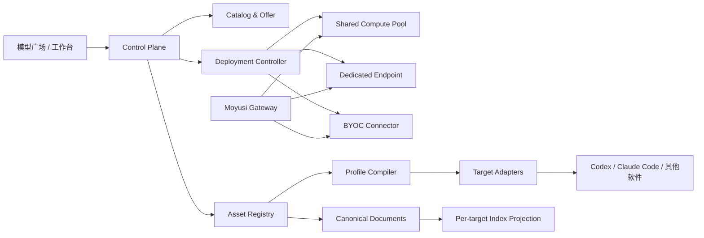

# 开放模型供给与可迁移 AI 工作环境

状态：产品与技术设计基线  
日期：2026-08-28

## 1. 核心结论

Moyusi 不应只做闭源模型的中转，也不应把 MCP、Skills、Prompts、记忆和知识库拆成五个新的产品入口。建议把产品升级为：

> **模型访问与 AI 工作环境的可迁移控制层**：用户在模型广场选择闭源 API 或开放模型算力，在工作台统一管理路由、费用和工作环境，并把经过兼容性转换的环境部署到不同模型与软件。

仍然只保留两个一级产品面：

1. **模型广场**：聚合闭源 API、共享开放模型、专属部署和用户自有算力。
2. **工作台**：管理路由、API、模型部署、工作环境、用量计费与账户。

“一键迁移”不是把某个厂商的内部状态原封不动搬走，而是：

- 以 Moyusi 的 `WorkspaceProfile` 保存可移植资产；
- 通过目标软件适配器生成该软件支持的配置；
- 在写入前显示差异、权限和兼容性；
- 对无法原样迁移的会话、记忆和索引生成可审计的转换结果；
- 保留备份、报告与回滚能力。

## 2. 对“开源模型”的准确表述

产品文案必须区分：

- **开放权重模型**：可以获取并部署权重，但许可可能限制商用、再分发、衍生模型或服务地区。
- **开放源代码推理引擎**：例如 vLLM、SGLang、TGI、llama.cpp，开放的是服务软件，不代表其加载的模型可自由商用。
- **符合开源定义的模型或组件**：只有许可证和所需组成部分满足相应定义时才能称为“开源”。
- **闭源托管 API**：用户只获得调用权，不获得模型权重或部署权。

因此，模型广场默认使用“闭源 API”“开放权重”“开放源代码引擎”等精确标签，不笼统使用“开源模型”。每个开放模型上线前必须审查模型卡、许可证、权重来源、使用限制和地区要求。

## 3. 模型广场的四类供给

### A. 闭源 API 线路

延续现有统一余额、BYOK 和供应商直连三种模式。用户按 Token、请求或模型定义单位付费，Moyusi 负责协议、路由、计量和供给透明度。

### B. Moyusi 共享开放模型

多个用户共享 Moyusi 或合作算力方维护的推理集群：

- 适合高频、标准化模型；
- 按输入/输出 Token 或请求计费；
- 热门模型保持热启动，长尾模型可弹性缩容；
- 必须展示并发限制、冷启动预期、量化方式和实际服务版本；
- 共享部署需要明确租户隔离、日志与正文策略。

### C. Moyusi 托管专属部署

为用户或团队创建独占端点：

- 按 GPU 小时、预留容量或月度实例计费；
- 支持固定模型版本、区域、硬件、量化和最小/最大副本数；
- 更适合私有数据、稳定时延、较高吞吐或定制推理参数；
- 推理费、算力占用费、存储费和 Moyusi 运维服务费必须分列。

### D. 用户自有算力 / 自托管端点

用户把已有 vLLM、SGLang、TGI、llama.cpp 或兼容端点连接到 Moyusi：

- GPU 云账单由用户直接支付；
- 端点凭证默认保存在本地或用户控制的 Secret Manager；
- Moyusi 可收取部署编排、监控、路由或工作台订阅费，不伪装成模型 Token 费；
- 可作为用户路由的首选、备用或仅限特定项目的私有线路。

Hugging Face 的托管推理端点把模型工件、推理引擎和可扩缩基础设施分开，并支持 vLLM、TGI、SGLang、llama.cpp、TEI 等引擎以及自动扩缩和缩容到零；这印证了 Moyusi 也应把“模型”和“部署”作为不同对象。[Hugging Face Inference Endpoints](https://huggingface.co/docs/inference-endpoints/about)

引擎也有生命周期，不能写死成永久等价的下拉项。例如 Hugging Face 已将 TGI 标记为维护模式并建议新端点考虑 vLLM 或 SGLang；Moyusi 的 DeploymentTemplate 因此必须固定引擎版本、标记维护状态并支持迁移 ServingRevision。[Hugging Face TGI](https://huggingface.co/docs/inference-endpoints/engines/tgi)

vLLM 提供 OpenAI-compatible server，可显著降低开放模型接入网关的成本；但协议形似兼容不代表 Responses、工具调用、JSON Schema、多模态和计量行为完全一致，仍需按服务版本做合同测试。[vLLM Quickstart](https://docs.vllm.ai/en/latest/getting_started/quickstart/)

## 4. 开放模型卡与部署卡

模型广场不要把模型与某次部署揉成一张营销卡。界面先展示 `CanonicalModel`，展开后比较 `RouteOffer` 或 `ServingEndpointOffer`。

### 模型身份

- 仓库与发布者；
- 模型 revision/commit；
- 权重 digest；
- 模型家族、参数规模和架构；
- 许可证、商业使用、再分发和衍生限制；
- 训练数据或来源声明的可用证据；
- 上下文、模态、工具调用、结构化输出与语言能力；
- Tokenizer 和 chat template 版本。

### 部署身份

- 引擎与版本；
- dtype、量化算法与量化版本；
- GPU/加速器类型、区域和租户模式；
- 最大上下文、并发、批处理和缓存策略；
- 热/冷状态、预计冷启动时间和缩容策略；
- TTFT、Token 吞吐、端到端时延、工具调用成功率及样本窗口；
- 数据处理、正文留存、训练使用和隔离策略；
- 计费类型：按 Token、GPU 小时、预留容量或外部账单。

模型详情的默认比较维度为“能力、许可、性能、隐私、成本”，不能只以单位 Token 价格排序。量化模型必须展示量化方式；不得把不同量化、不同模板或不同修订静默视为完全相同的线路。

## 5. 开放模型部署产品流程

### 5.1 共享端点

```text
选择模型 → 选择共享线路 → 查看热/冷状态与单价 → 加入路由 → 首次调用
```

热门模型可以像闭源 API 一样进入统一余额。长尾共享端点只有在容量、冷启动和价格都可预测时才开放销售。

### 5.2 专属部署

```text
选择模型 → 选择区域/硬件/版本 → 成本预估 → 许可确认
→ 创建部署 → 拉取/校验权重 → 健康与能力测试 → 生成私有线路
```

创建前必须显示：最低持续费用、预计启动时间、停机是否仍计存储费、缩容规则、容量上限和删除后的数据处理。

### 5.3 连接自有端点

```text
选择引擎类型 → 填写地址或本地发现 → 绑定 Secret 引用
→ 协议/能力探测 → 标记能力矩阵 → 加入目标路由
```

Moyusi 只记录连接描述、能力结果和 Secret reference；非必要不保存原始 Secret。公网端点需要 TLS、认证、来源限制和证书校验，本地端点默认只允许 loopback 或经明确授权的私网连接。

## 6. 工作台中的“工作环境”

工作台增加一个子域“工作环境”，但不为 MCP、Skills、Prompts、记忆和知识库分别设置一级入口。

```text
工作台
├── 总览
├── 路由
├── API 与来源
├── 模型与部署
├── 工作环境
│   ├── Profiles
│   ├── MCP / Skills / Prompts
│   ├── 记忆 / 知识库
│   └── 目标软件、同步记录与迁移报告
├── 用量与计费
└── 账户
```

### WorkspaceProfile

`WorkspaceProfile` 是一键迁移的最小用户心智单位，不是单个配置文件。它包含：

- 名称、版本、来源与适用项目；
- 默认模型、候选路由和数据策略；
- 一组 MCP Server；
- 一组 SkillBundle；
- 一组 PromptTemplate；
- 经用户确认的 MemoryItem；
- 一组 KnowledgeBase；
- 目标软件、权限和兼容性策略；
- Secret binding 引用，不包含可导出的明文 Secret。

用户的主流程是“选择工作环境 → 部署到 Codex/Claude Code/其他软件”，而不是逐个复制几十项配置。

## 7. 五类统一资产

### 7.1 MCP

Moyusi 保存 MCP Server 的可移植描述：

```text
McpServer
  id, name, version, protocol_revision, transport, endpoint_or_command
  argument_template, env_secret_refs, oauth_binding
  requested_scopes, tool_allowlist, data_classification
  source, signature, health, target_overrides
```

MCP 的服务能力包括 Resources、Prompts 和 Tools，并强调用户同意、控制及工具安全；因此“连接成功”不等于“可默认执行所有工具”。[MCP Server Overview](https://modelcontextprotocol.io/specification/2025-06-18/server/index)

MCP 最新的 2026-07-28 版本已经改为无状态协议核心，并加入请求头路由、列表缓存提示和授权加固，说明 Target Adapter 还必须按 `protocol_revision` 管理能力，不能只保存一个 server URL。[MCP 2026-07-28 release](https://blog.modelcontextprotocol.io/posts/2026-07-28/)

产品要求：

- 安装前显示服务器来源、命令、域名、权限、数据范围和 Secret 需求；
- 默认禁止未知服务器自动运行本地命令；
- OAuth token 和 API Key 只通过 Secret binding 绑定；
- 跨工具迁移时重新请求目标软件所需授权；
- 保存健康结果和最后确认时间，不把一次成功测试视为永久可信。

### 7.2 Skills

`SkillBundle` 以 Agent Skills 的 `SKILL.md + scripts/references/assets` 目录形态作为优先交换格式，保存来源、版本、摘要、签名和权限。Agent Skills 规范允许技能包含脚本与附加资源，并指出部分字段和运行方式依赖具体客户端，因此 Moyusi 必须保留兼容矩阵，而不是假设所有软件执行语义相同。[Agent Skills Specification](https://github.com/agentskills/agentskills/blob/main/docs/specification.mdx)

OpenAI 官方 Skills API 也把 Skill 作为可上传的目录或 zip，并提供默认/最新版本语义，这支持 Moyusi 将技能建模为有版本的包，而非一段不可追溯的提示词。[OpenAI Skills API](https://developers.openai.com/api/reference/python/resources/skills/methods/create)

每个 SkillBundle 必须记录：

- manifest、内容 digest、版本和来源；
- 兼容的目标软件和最低版本；
- 允许使用的工具、网络、文件和命令权限；
- 脚本静态扫描与恶意内容检查结果；
- 用户修改与上游更新的差异；
- 发布签名与撤回状态。

MVP 只做私有技能包的导入、版本、部署和回滚，不做公共技能市场和排行。

### 7.3 Prompts

`PromptTemplate` 不是单一大文本，建议拆成：

```text
PromptTemplate
  id, name, version, purpose
  system_policy, developer_instructions, task_template
  variables, required_tools, required_context
  target_variants, eval_cases, safety_notes, provenance
```

不同厂商对 system/developer/user 层级、工具选择和上下文优先级的处理不同。Moyusi 保留规范化意图和目标变体，部署时由 Adapter 编译；不能保证不同模型给出相同行为。

### 7.4 会话记忆

记忆必须与聊天记录分开：

```text
MemoryItem
  id, scope, statement, source_refs, confidence
  sensitivity, review_status, expires_at, supersedes
```

- `scope` 至少区分用户、项目、任务；
- 只有用户确认或满足明确自动提取策略的事实进入长期记忆；
- 每条记忆保留来源、更新时间和覆盖关系；
- 支持查看、修正、删除、过期和禁止同步；
- 敏感记忆不得自动发送给不满足数据策略的模型或 MCP Server。

Claude Code 官方文档显示其记忆可使用明文 Markdown，并区分用户/项目等作用域，这说明文本记忆具备迁移基础；但目标软件作用域和加载规则仍需 Adapter 转换。[Claude Code Memory](https://code.claude.com/docs/en/memory)

### 7.5 知识库

知识库的事实源是用户文档及其权限，不是某个向量数据库中的 embedding：

```text
KnowledgeBase
  id, name, source_connectors, document_refs
  acl, data_classification, sync_policy
  canonical_revision, chunk_policy, target_indexes
```

- 原始文档、版本、来源和 ACL 是可移植层；
- chunk、embedding 和索引是目标运行时的 projection；
- 更换 embedding 模型或目标软件时应重新切分/嵌入，不能直接宣称旧向量无损复用；
- 检索结果需保留文档、版本和片段引用；
- 删除源文档或撤销权限后，所有目标索引必须可追踪清除。

## 8. 会话迁移的产品承诺

### PortableSession

Moyusi 可以保存：

- 原始可导出的消息与附件引用；
- 规范化的 role/content/tool call/tool result；
- 关键决策、用户偏好、开放任务和产物；
- 源应用、模型、时间、权限和导入格式；
- 生成迁移检查点时使用的模型、Prompt 和版本。

目标软件获得的是“新会话 + 迁移检查点”，而不是继续原厂会话进程。Claude Code 文档也说明不同界面维护各自会话历史、CLI 会话依赖本地 transcript；这类厂商会话 ID 和运行时状态不能跨产品通用。[Claude Code Sessions](https://code.claude.com/docs/en/sessions)

### 可以与不可以迁移

| 等级 | 典型资产 | Moyusi 行为 |
| --- | --- | --- |
| L1 原样携带 | 源文档、附件、普通 Prompt 文本、标准 Skill 目录 | 校验 digest 后复制或引用 |
| L2 适配转换 | MCP 配置、指令文件、Prompt 角色、工具权限 | Adapter 编译并显示 diff |
| L3 语义重建 | 会话检查点、长期记忆、知识库索引 | 保留来源，重新摘要或重建索引 |
| L4 不可迁移 | 隐藏推理、厂商系统 Prompt、内部缓存、私有工具状态、原会话进程 | 明确报告不支持，不伪造 |

产品文案可以使用“一键迁移工作环境”，不能使用“所有会话无损续接”或“不同模型结果完全一致”。

## 9. 一键迁移流程

```text
发现目标软件与版本
→ 选择 WorkspaceProfile
→ 生成能力与兼容性报告
→ 绑定目标环境 Secret
→ 预览配置 diff 和权限变化
→ 创建备份并原子写入
→ 运行 MCP/Skill/模型/知识库健康测试
→ 输出迁移报告；失败时回滚
```

迁移报告中的每个对象只有四种结果：

- `exact`：原样部署；
- `adapted`：经过确定性转换；
- `rebuilt`：重新摘要、索引或生成检查点；
- `unsupported`：目标软件不支持或权限不允许。

不允许使用模糊的“同步成功”掩盖部分失败。Adapter 必须按目标软件版本维护 fixture、黄金 diff 和回归测试。

## 10. 目标软件适配器

```text
TargetAdapter
  target, supported_versions, capability_matrix
  discover(), plan(), validate(), apply(), verify(), rollback()
```

首批适配顺序：

1. **Codex**：Provider/模型、项目指令、MCP、Skills；实现时以目标版本的 OpenAI 官方文档和 fixture 为准。
2. **Claude Code**：Provider、CLAUDE.md、`.claude/skills`、MCP、可导出会话检查点；以实际版本验证路径和优先级。
3. **Gemini CLI / OpenCode**：在前两者的资产模型稳定后接入。
4. **通用导出**：标准 Skill 目录、MCP JSON、Markdown 指令、源文档 manifest 和 PortableSession JSONL。

Moyusi 规范格式不能变成新的锁定。用户必须能导出不含明文 Secret 的完整可移植包；目标适配器应尽量使用公开格式，并保留未识别字段供以后重新转换。

## 11. 技术架构增量



新增领域对象：

```text
ModelArtifact         # repo/revision/digest/license/model card
DeploymentTemplate    # engine/hardware/quantization/region/defaults
ServingRevision       # 不可变的模型 + 引擎 + 参数组合
ComputePool           # 共享或专属算力池
ServingEndpoint       # 可健康探测、可路由的实例
CapacityReservation   # 用户容量、时间、上限和状态
DeploymentCostRate    # GPU/存储/流量/服务费版本

WorkspaceProfile      # 可迁移工作环境及版本
McpServer
SkillBundle
PromptTemplate
MemoryItem
KnowledgeBase
PortableSession
SecretBinding         # 只指向本地或受控 Secret，不进入导出包
TargetAdapter
MigrationPlan
MigrationReport
```

`RouteOffer` 的目标可以是签约 `UpstreamChannel`，也可以是 Moyusi 管理的 `ServingEndpoint`。任何请求仍需绑定实际服务修订、能力矩阵、价格版本和计量事件。

开放模型的服务身份至少由以下组合固定：

```text
repo + revision + weights_digest + tokenizer + chat_template
+ dtype/quantization + engine/version + serving_args
```

只记录营销名称不足以支持可复现路由、性能比较和账务争议。

## 12. 安全与治理

- **Secret 不迁移，只重新绑定。** 导出包只包含 Secret reference 和所需 scope。
- **技能按代码处理。** 带脚本的 Skill 必须扫描、签名、声明网络/文件/命令权限，并在受限环境验证。
- **MCP 按外部执行面处理。** 工具调用要有来源、权限、用户同意和审计；高风险工具默认逐次确认。
- **记忆按用户数据处理。** 支持敏感度、作用域、保留期、导出和删除。
- **知识库权限随源走。** 检索索引不能扩大原文档 ACL。
- **路由受数据策略约束。** 私密 Profile、记忆或知识不得发送到不满足地区/留存策略的模型线路。
- **迁移默认本地执行。** 能在桌面端完成的配置发现、diff 和 Secret 绑定不上传云端。
- **开放模型供应链可追踪。** 权重、容器、依赖、许可证和部署参数均有 digest、SBOM 与撤回机制。

## 13. MVP 与阶段建议

### P0：验证“选模型 + 带走工作环境”

- 模型广场同时展示闭源 API 与至少一个共享开放模型；
- 可连接一个用户自有 OpenAI-compatible 开放模型端点；
- Codex、Claude Code 的 `WorkspaceProfile`；
- MCP、私有 Skills、Prompts 的导入、版本、部署、diff 和回滚；
- Secret 只做绑定，不进入同步包；
- 开放模型卡展示 revision、许可、量化、引擎、性能和冷启动；
- 不在 P0 做公共技能市场、任意 GPU 编排或跨软件会话无损恢复。

### P1：规模化托管部署与可信知识

- 扩展共享模型目录，并提供专属开放模型部署；
- 模型工件与 ServingRevision 供应链；
- 经用户审核的长期记忆；
- 源文档知识库同步、ACL 和按目标重建索引；
- 更多目标软件 Adapter；
- Profile 跨设备同步与迁移报告。

### P2：生态与团队

- 用户自有云账号中的 BYOC 编排；
- PortableSession 导入/导出和会话检查点；
- 团队 Profile、审批、策略与共享知识库；
- 经审核的供应商部署模板与技能目录；
- 供应商市场和容量结算。

## 14. 成功指标

| 指标 | 含义 |
| --- | --- |
| Profile 首次部署成功率 | 目标软件完成写入并通过验证的比例 |
| 迁移资产可用率 | exact + adapted + rebuilt 且验证通过的资产比例 |
| 回滚成功率 | 失败部署恢复到原配置且目标软件可启动的比例 |
| 开放模型首次可调用时间 | 从选择到端点健康、可实际请求的中位时间 |
| ServingRevision 可追溯率 | 请求能追到权重、引擎、量化、硬件和价格版本的比例 |
| Secret 外泄事件 | 必须为 0 |
| 知识引用命中率 | 检索回答能返回有效源文档引用的比例 |

## 15. 仍待验证的决策

1. 首发开放模型及其商业许可、目标地区和硬件成本。
2. 共享端点是否保持热启动，以及可接受的最长冷启动。
3. GPU 采购采用自营云账号、算力合作方还是用户 BYOC。
4. P0 WorkspaceProfile 是仅本地存储，还是提供端到端加密同步。
5. Codex、Claude Code 各版本对 MCP、Skills、指令和会话导出的真实兼容矩阵。
6. 自动提取记忆是否默认关闭，以及什么内容必须人工确认。
7. 知识库首发连接器、文件大小、同步频率和数据驻留范围。
8. 工作台 Pro 对工作环境同步、部署编排和高级路由的收费边界。
